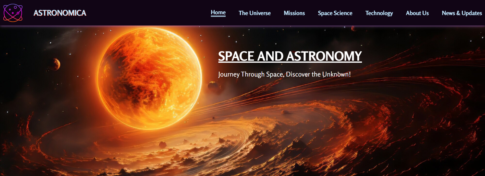

# Astronomica

**Astronomica** is a web project designed to provide users with an immersive experience exploring astronomical phenomena. The project utilizes HTML and CSS to create a visually appealing and informative platform for astronomy enthusiasts.

## Explore the live version of the project:

[icp-11-css-github-project-2-astronomica.vercel.app](https://icp-11-css-github-project-2-astronomica.vercel.app)

## Features:

- **Responsive Design:** Ensures compatibility across various devices and screen sizes.
- **Interactive Content:** Engaging visuals and information about celestial bodies and events.
- **User-Friendly Navigation:** Intuitive layout for seamless browsing.

## Usage:

- **Home Page:** Provides an overview of the project and its purpose.
- **Pages Directory:** Contains additional HTML files with detailed information on various astronomical topics.
- **CSS Directory:** Houses the stylesheets that define the visual presentation of the site.
- **Images Directory:** Contains all the images used throughout the project.

## Contributors:

## Contact:

_For any questions or feedback, please contact:_

**Ravikant Tarare**

📩 [ravikanttarare2001@gmail.com](mailto:ravikanttarare2001@gmail.com)

📞 [8275957698](tel:8275957698)
